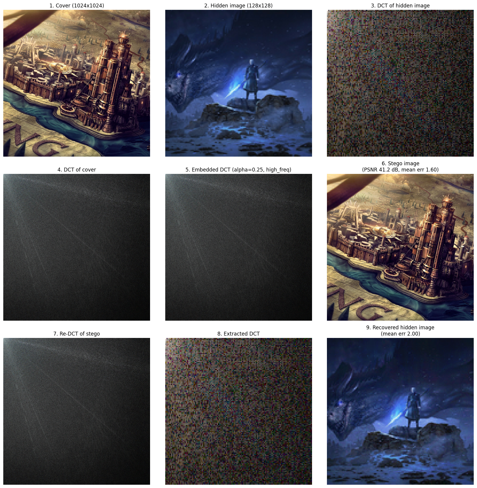

# DCT-Based Image-in-Image Steganography

Hiding one image inside another by writing the hidden image's DCT coefficients
into scattered coefficients of a larger cover image. The DCT and inverse DCT are
implemented by hand (no `scipy.fftpack`, no OpenCV transform) — the point of the
project is the transform itself, not just the hiding.

## The idea

A DCT moves an image from the pixel domain into the frequency domain. Each output
coefficient says "how much of this cosine wave is in the picture", and because the
transform is invertible we can go back to pixels afterwards. That gives us a place
to hide things: nudge a few frequency coefficients, transform back, and the change
is spread thinly across every pixel instead of sitting in one visible spot.

Concretely, for a 1024×1024 cover and a 128×128 secret (an 8× ratio):

```
                 DCT                  embed                IDCT
  cover 1024²  ------>  1024² coeffs  ------>  modified  ------>  stego image
                                          ^                    (looks like the cover)
  secret 128²  ------>   128² coeffs  ----+
                 DCT
```

The secret has 128×128 coefficients and the cover has 1024×1024, so the secret's
coefficients are spread out on a regular grid — one every 8 cells. Each one is
written as:

```
z = x + alpha * y
```

where `x` is the cover's original coefficient, `y` is the secret's, and `alpha`
controls how strongly we push. Extraction reverses it:

```
y = (z - x) / alpha
```

Note the `- x`: recovering `y` means undoing the cover coefficient we added. That
makes this scheme **non-blind** — the receiver needs the original cover image.
This is the single most important line in the project; getting it wrong is what
the fix below was about.

### Where the coefficients go

`method` in the config picks the grid offset within each 8×8 cell:

- `center` — middle of the cell (`sx*8 + 4`)
- `high_freq` — last cell position (`sx*8 + 7`), biasing toward higher
  frequencies, where the eye is less sensitive

Both are computed by `target_position()` in `embed.py`, shared by the embedder and
the extractor so the two can never disagree about where a coefficient lives.

## Result

Cover `img_1024/img1.png`, secret `img_128/img2.png`, `alpha=0.25`,
`method=high_freq`. Reproduce with `python demo.py`.



Reading the nine panels: the top row is the two inputs and the secret's DCT; the
middle row is the cover's DCT, the same DCT after embedding, and the resulting
stego image; the bottom row re-transforms the stego image, pulls the secret's
coefficients back out, and inverts them to recover the hidden picture.

Panels 4, 5 and 7 look almost black because DCT energy concentrates overwhelmingly
in the low frequencies (top-left corner) — they are drawn on a log scale and still
look flat. That is exactly why the trick works: there is plenty of room in the
high-frequency coefficients where almost no energy lives. Panels 4 and 5 are also
visually indistinguishable, which is the point: the embedding is invisible even in
the domain where it happens.

| Metric | Value |
|---|---|
| Cover distortion (mean abs) | 1.60 |
| Cover PSNR | 41.21 dB |
| Recovered secret error (mean abs) | 2.00 |
| Runtime (1024², 3 channels, full round trip) | ~23 s |

## The alpha trade-off

`alpha` sets how hard the secret is pressed into the cover, and the two goals pull
against each other. Measured on the images above:

| alpha | Cover PSNR | Cover err | Secret err | Verdict |
|-------|-----------|-----------|------------|---------|
| 0.10  | 48.81 dB  | 0.60      | 4.30       | Cover pristine, secret grainy |
| **0.25** | **41.21 dB** | **1.60** | **2.00** | **balanced — used above** |
| 0.50  | 35.25 dB  | 3.23      | 1.23       | Secret clean, cover starts to smudge |

How visible this is depends on the cover. A busy, textured image like the one above
hides the change well; a photo with large flat areas (a plain wall, clear sky)
shows blotches much earlier, because there is no detail to mask them.

Why the secret degrades at all: the stego image is saved as an 8-bit PNG, so every
pixel is rounded to a whole number. That rounding is noise, and extraction divides
by `alpha` — so it gets amplified by `1/alpha`. At `alpha=0.1` the ±0.5 rounding
error is multiplied tenfold.

This was verified by skipping the rounding step entirely (`alpha=0.25`):

| Pipeline | Secret error |
|---|---|
| float, no quantization | **1.1e-11** |
| rounded to integers | 1.86 |
| rounded + clipped to 0–255 (real PNG) | 2.00 |

So the maths is exact — recovery is perfect to eleven decimal places — and all
visible loss comes from 8-bit storage. Clipping contributes only a small part
(0.8% of pixels fall outside 0–255 and get clamped). Storing the stego image as
floats would make recovery perfect, but then it is no longer an ordinary image
file, which defeats the purpose.

## Bugs found and fixed

**1. `decrypt()` never subtracted the cover coefficient.** It computed `z / alpha`
instead of `(z - x) / alpha`, so the cover's own value leaked straight into the
recovered secret — and since the leak is `x / alpha`, it got *worse* as alpha got
smaller. The function's own docstring described the correct formula; the code did
not implement it.

Mean absolute error of the recovered secret, same images as above:

| alpha | before (`z/alpha`) | after (`(z-x)/alpha`) |
|-------|-------------------|----------------------|
| 0.10  | 92.29 | **4.30** |
| 0.25  | 67.75 | **2.00** |
| 0.50  | 45.13 | **1.23** |

**2. `encrypt()` discarded the cover when encryption was off.** It returned
`alpha * y` instead of `x + alpha * y`, throwing away the cover coefficient
entirely and damaging the stego image.

**3. Unknown `method` failed confusingly.** `embed_2d` had `if`/`elif` with no
`else`, so a bad method name raised `UnboundLocalError` on an undefined `bx`. It
now raises a clear `ValueError`. Relatedly, a caller passing a config with no
`method` key got a bare `KeyError`.

## Fast DCT

The direct implementation is O(n³) per 2D transform and needs ~100 s for a single
1024×1024 channel — about 16 minutes for one full round trip.

The same summation is a matrix product. Building the coefficient matrix once:

```
C[k, i] = sqrt(2/n) * ck * cos(2*pi*k/(2n)*i + k*pi/(2n))

2D DCT:   X = C @ img @ C.T
2D IDCT:  img = C.T @ X @ C
```

This is the identical formula from `dct_1d`, just written as a matrix instead of a
loop — still our own cosine maths, no library transform. `C` turns out to be
orthonormal (`C @ C.T == I` to 5e-15), which independently confirms that the
inverse really is the transpose.

Both versions ship. The loop functions (`dct_1d`, `dct_2d`, `dct_3d` and inverses)
are untouched and remain the readable reference; the matrix versions are
`dct_2d_fast`, `dct_3d_fast`, `idct_2d_fast`, `idct_3d_fast`.

```bash
python test_matrix_dct.py
```

verifies they agree (largest difference 7e-13, far below the 1e-9 tolerance) and
times the fast path:

| Size | Loop | Matrix |
|------|------|--------|
| 512² | ~100 s | 0.014 s |
| 1024² | ~13 min | 0.16 s |

`run_embed.py` has a `USE_FAST_DCT` flag to switch back to the loop version.

## Layout

```
steganography/
├── dct.py               # hand-written DCT/IDCT + matrix versions
├── embed.py             # encrypt/decrypt + coefficient placement
├── receiver.py          # extraction (needs the original cover)
├── sender.py            # embed via config.json
├── demo.py              # the run that produced the figure above
├── test.py              # small synthetic test + 9-panel plot
├── test_matrix_dct.py   # proves matrix DCT == loop DCT
├── resize.py            # batch image preprocessing
├── config.json
└── img_<N>/             # images pre-resized to N x N
```

## Running it

Requires numpy, opencv-python, matplotlib, pillow (`requirements.txt`).

```bash
python test_matrix_dct.py   # check the fast DCT matches the reference one
python demo.py              # embed, extract, write docs/pipeline.png
```

Cover and secret must keep the 8:1 size ratio. The image paths, sizes, `alpha` and
`method` are all set at the top of `demo.py`. `resize.py` prepares new images at
the required sizes.

## Notes and limits

- **Non-blind.** Extraction needs the original cover image, not just the stego one.
  A blind version would need to encode the secret so that it can be detected
  without a reference (e.g. quantization index modulation).
- **PNG only.** The scheme assumes lossless storage. Saving the stego image as JPEG
  would quantize exactly the high-frequency coefficients the secret lives in and
  destroy it.
- **Fixed 8:1 ratio.** The grid stride is `big // small`, so other ratios work
  arithmetically, but a smaller ratio packs coefficients more densely and distorts
  the cover faster.
- **The `encrypt` path is unused.** `config.json` ships with `"encrypt": false`.
  The modular-exponentiation option (`y^p mod q`) only works on small integers, so
  it does not survive real DCT coefficients as written.
